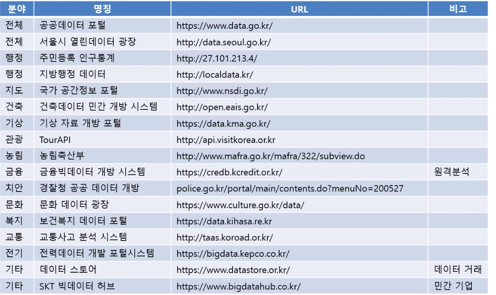

데이터 : 현상이나 사실을 관찰하여 기록한 기호. 숫자, 그림, 단어, 영상 등의 형태로 존재.  
정보 : 데이터가 축적이되고 맥락이 있으면 정보가 된다.  
리터러시 : 글을 읽고 쓸줄 아는 문해력.  
정보 리터러시 : 정보가 필요할 때 인식하고 정보를 효과적으로 찾아 평가하고 활용하는 능력.  

인간의 10가지 본능  

|간극본능|모든것을 서로 다른 두 집단, 상충하는 양극으로 나눔. |
|---------------------------------------------------|
|부정본능|좋은것보다 나쁜것에 더 집중하는  |
|---------------------------------------------------|
|직선본능|어떤 현상이 동일한 추세로 나타날것으로 생각하는. |
|---------------------------------------------------|
|공포본능|극단적이고 언론에 노출되는 공포스러운 일에만 신경쓰는. |
|---------------------------------------------------|
|크기본능|비율을 왜곡해 실제보다 사실을 부풀리는.|
|---------------------------------------------------|
|일반화본능|특정 사례를 들어 집단 전체를 일반화하는 성향|
|---------------------------------------------------|
|운명본능|국가,종교,문화 등 타고난 특성이 운명을 정할것이라는|
|---------------------------------------------------|
|단일관점본능|하나의 관점으로 모든것을 평가하려는|
|---------------------------------------------------|
|비난본능|모든 잘못된 일들을 특정인 혹은 특정집단에게 전가하는.|
|---------------------------------------------------|
|다급화본능|위험이 임박했다고 느낄때 즉각 행동하고 싶은.|
|---------------------------------------------------|

막대그래프 : 잘라내는것없이 (예외없이) 기준점 0 에서 시작한다.  
선그래프 : y증분 잘. 차트의 2/3 정도 차지.  
파이차트 : 5개넘으면 기타로 하기.  
카토그램 : 인구밀도를 고려한 지도그래프.  

육하원칙 : 분석에 꼭 필요한.  

상관관계 : 두 변수가 선형적으로 연관되어 있어 함께 변화하는 관계  
인과관계 : 두개의 사실 중 한쪽이 원인, 다른쪽인 결과인 관계  

인과관계의 성립조건  

1. 원인이 결과보다 시간적으로 앞서야하고,  
2. 원인과 결과는 관련이 있어야하고,  
3. 다른변수가 아닌 원인이 되는 변수만으로 설명이 되어야한다.  

유용한 공공데이터 

1. data.go.kr - 생활인구데이터  
2. localdata.go.kr - 지방행정인허가 데이터  
3. rtdown.molit.go.kr - 부동산실거래가 데이터  
4. aihub.or.kr/ai_data - ai 학습용 데이터  
5. bigdata.seoul.go.kr - 빅데이터 서울  
6. data.kostat.go.kr - 통계청.  
7. datastore.or.kr - 데이터산업진흥원

데이터 시각화에 필요한 요소  

1. 도메인 지식
2. 세심한 관찰력
3. 의사소통능력 
4. 시각화 도구 

실습 

https://datastudio.google.com/reporting/9bfdf7d0-0e60-4340-9baf-14bff5c959fa